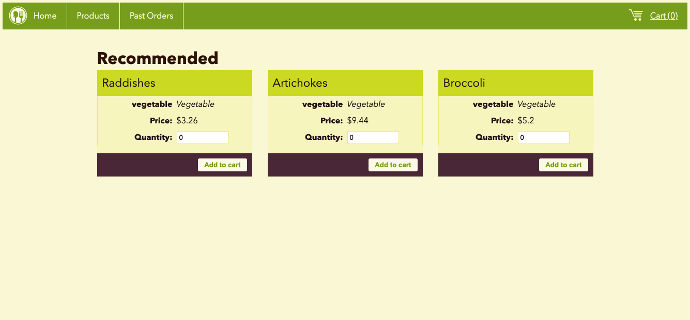
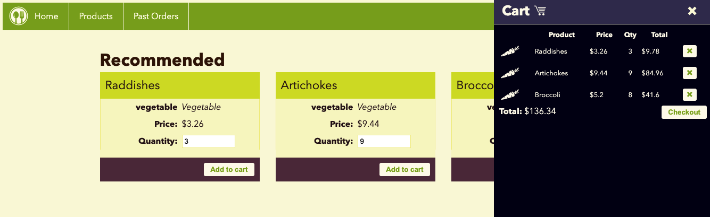
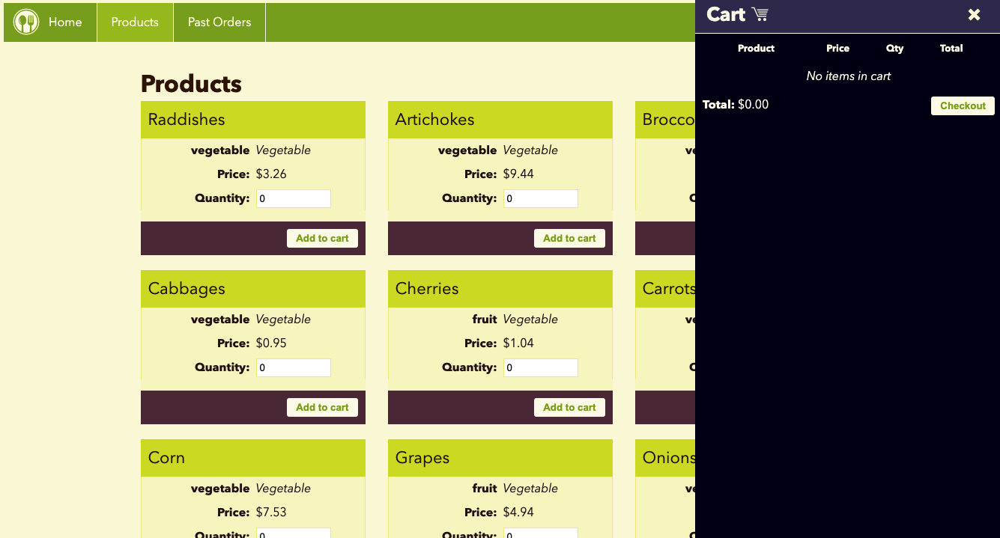
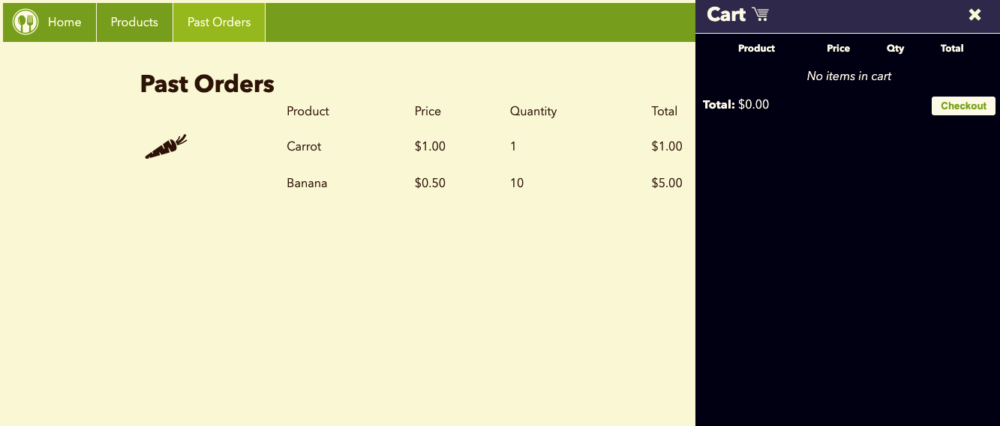

# Vue 3 - Products and Cart App

## What is this about?

Demo of a website that contains products you can add and delete off a cart.</br>
Products come in via `.json`, not via `fetch`.</br>
A code-along to freecodecamp's free course, see YouTube video [Vue.js Course for Beginners [2021 Tutorial]](https://www.youtube.com/watch?v=FXpIoQ_rT_c)</br>

- up to 1:14:31, it's working on basic code of the project in single html files; Vue comes in via CDN, see `<script src="https://unpkg.com/vue@next"></script>` tag, also see here https://v3.vuejs.org/guide/installation.html#release-notes
- from 1:14:31 to 2:15, it's about having the application code in a more modular environment; Vue comes in via CDN, see `<script src="https://unpkg.com/vue@next"></script>` tag
- from 2:26 on, it's introducing Vue CLI and making the project more dynamic

### Visuals





The code you see in my project is not built from scratch.</br>
It is based on [this branch/code](https://github.com/gwenf/vue3-fcc-course-basic-product-cart-demo/tree/home-page-1), coded along until the final result, so it already came with HTML and styling.</br>
I did not clone the `starter-code` branch of that repository but the `home-page-1`.</br>
If you are interested in the final result solved by the tutor, [see their final branch here](https://github.com/gwenf/vue3-fcc-course-vue-cli-product-cart-demo/tree/4-reusable-components).</br>
In my example at point of writing the "Past Products" page ist still static.</br>

### How to run it?
- clone the repo
- cd into project `products-and-cart-app`
- run `npm install`
- run `npm run serve`, this will fire up the server at
```
 App running at:
  - Local:   http://localhost:8080/
  - Network: http://192.168.178.53:8080/
```
- stop the server with `control c`
- run `npm run build`, to compile and minify for production
- run `npm run lint`, to lint and fix files

### Nice to know - Steps towards product app

The freecodecamp course provides a great step by step tutorial, starting with the most basic learning regarding Vue 3.</br>

#### Find the basic learning and code-along examples here:

[01 Intro into Vue - Simple Examples](https://github.com/EllyPirelly/products-and-cart-app/tree/main/steps-towards-app/01-intro-into-vue)

#### Find the Basic Products App here, still without Vue CLI, Vue coming in via CDN:

[02 - Basic Product App](https://github.com/EllyPirelly/products-and-cart-app/tree/main/steps-towards-app/02-basic-product-app-via-script)

I do not plan to work with the Basic Products App again, only have it here for completeness sake.

### These are the sources of the tutor
- [Static files from initial lessons](https://github.com/gwenf/vue3-fcc-course-static-code)
- [Product and Cart Static Code Demo](https://github.com/gwenf/vue3-fcc-course-basic-product-cart-demo)
- [Product and Cart Vue CLI Demo](https://github.com/gwenf/vue3-fcc-course-vue-cli-product-cart-demo)

### Install Vue CLI

- https://cli.vuejs.org/guide/installation.html
- run `npm install -g @vue/cli`
- version at time of wriing `@vue/cli 4.5.15`

### Create a Vue Project

 - https://cli.vuejs.org/guide/creating-a-project.html
 - run `vue create YOUR-PROJECT-NAME`

```
   App running at:
  - Local:   http://localhost:8080/
  - Network: http://192.168.178.53:8080/
```

### Customize configuration
See [Configuration Reference](https://cli.vuejs.org/config/)

### How to work with scss

- https://cli.vuejs.org/guide/css.html
- `npm install -D sass-loader@^10 sass`
