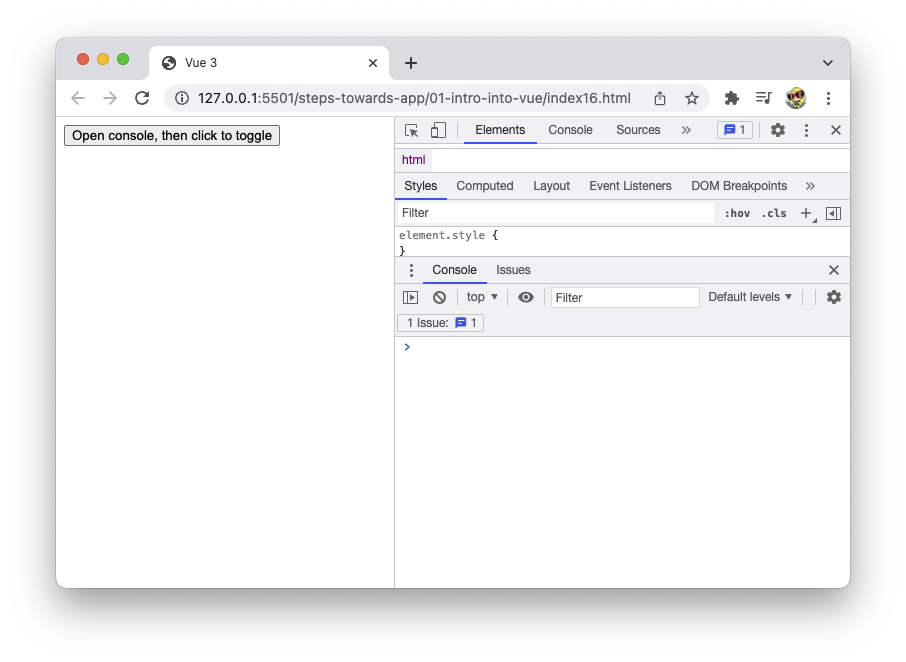

# Vue 3 - Basic Vue Examples
- all single html files have all of their code in ONE file to  make it easier to understand what's referenced where
- they most make sense looking at them in order 01 to 17
- they have Vue enabled via CDN (see `<script>` tag)
- to start a single html file, open it in the browser of your choice
- development is covered in https://www.youtube.com/watch?v=FXpIoQ_rT_c up until 1:14:31

### index01.html
- shows the absolut simplest Vue application, with a minimum of data


### index02.html
- shows the simplest Vue application, this time with a passed variable `greeting`


### index03.html - v-if, v-else-if, v-else
- has 3 differently colored boxes, styled in the `<style>` tag
- to see change, play around in the code with changing `true` and `false` in the `return` statement at the bottom of the code
- triggering of different colors is mapped via `v-if`, `v-else-if`, `v-else`
- `v-cloak` on the outermost container (styled as `[v-cloak] { display: none; }`) prevents that little flickering of page content on page reload


### index04.html - toggling of a box
- toggling is done via button and toggling visibility on click `<button @click="isVisible = !isVisible">`
- `@` is the same as `v-something`
- `@click` is the same as `v-on:click`


### index05.html - toggling of a box via function
- the simple toggling from previous `index04.html` is now improved in extracting the toggling in a `toggleBox()` function in `methods`
- functionality is the same as in `index04.html`


### index06.html - input field - log static value
- how to pass a static value into a simple input field and log it to the console
- place the cursor into the input field and hit enter
- this will log the value of the variable `greeting` to the console
- in the `input` we are explicitly listening for a `keyup` event, aka keycode 13
- instead of `@keyup.enter` you can also use `@keyup.13`
- the `input` is not a component yet


### index07.html - input field - log static value
- have the value of the variable `greeting` as a mix of both, value of passed-in variable `greeting` (`greeting: 'Aditionally pass something after this: '`) and static value coming in as a string (`+ 'with something passed into the function'`)
- place the cursor into the input field and hit enter to log and display the combined value to the console
- the `input` is not a component yet


### index08.html - two input fields, the base
- two `inupt` fields, coming in as a component via `template`
- for this example, click the "Submit things" button straight away, this will log "submitted" to the console
- use `@submit.prevent` on the `handleSubmit()` function within `form` to prevent the default reloading of a page once the button is clicked and data is submitted; it's the same as `e.preventDefault`
- by default, button are of type submit


### index09.html - two input fields, values with `this.`
- based on `index08.html` have now the value put into the `input` fields referenced via `this.`
- now, type somthing into the input fields and hit enter, this will log to the console what you've entered in the input fields
- be aware that the `input` field of `type="email"` requires to enter a (fake) email address


### index10.html - two input fields, pass value to a child component
- at this point in code, nothing will be logged to the console
- the only thing logged is the amount of how many times you've clicked
- this is on purpose
- this state of code shows how to pass `label` text as a string to the `custom-input` child component
- for that, we now have another component `custom-input` as a child component to the `form` component
- within the child component `custom-input` we pass the `label` variable value via `props`
- the `custom-input` child component is passed to the parent component `form` via `components: ['custom-input']` and the `<custom-input ... />` tag


### index11.html - two input fields, pass value to a child component via function
- still nothing logged to the console here besides of the amount of how many times you've clicked
- it's just the next step based on `index10.html`
- it shows how to change strings coming in like this in `index10.html`:
```
<form @submit.prevent="handleSubmit">
  <h1>{{ title }}</h1>
  <custom-input type="email" label="Pass email text as a string" />
  <custom-input type="password" label="Pass password text as a string" />
  <button>Submit things</button>
</form>
```
- to values coming in via the `data()` function in `index11.html`:
```
data() {
  return {
    title: 'Login Form',
    email: '',
    password: '',
    emailLabel: 'Email label via v-bind',
    passwordLabel: 'Password label via v-bind'
  }
},
```
- those are bind via `v-bind:label`
- shortcut for `v:bind` (as it's super commont to use) is `:` - only a colon
- `v:bind` makes Vue look for a variable


### index12.html - two input fields, a child component - `v-model`
- shows how to have a child component `custom-input` with a `template` of `label` that's then referrenced in the parent component `login-form`
- shows how the variable `label` is referenced
- as we don't have access to what's happening in the child component `custom-input` we need to `v-model` it
- the `data()` function will have updating the data in sync
- how do you get the value of the variables up to the parent component, as you want to stay in sync with the 2 variables `email` and `password` so that if the `form` is submitted you have access to it in the `handleSubmit()` function?
- the most straightforward way for now is to use `v-model="email"` and `v-model="password"` on the child component
- in this context under the hood `v-model` is giving us another prop called `:modelValue`, which in our case maps to `email` and `password`
- `v-model` does a few steps at once, it's kind of a shorthand
- with this code you get to extract input data (`inputValue`) and get to log it to the console
- but: data is not updated yet


### index13.html - two input fields, a child component, getter and setter
- how to you update the passed data now?
- delete input data off of the `data()` function
- add a setter function
- update data will be logged to the console once submit is hit


### index14.html - loops with index
- create an `inputs` array within the `data()` function
- add strings there
- reference them in the `p` tag within the parent component `form`
- here, whenever you do a loop you have to add a `key` prop and this key has to be unique on each iteration of the loop
- the `key` will uniquely identify any elements that you loop through in your Vue.js templates
- this can help with performance and preventing bugs in your application
- get an index through each iteration of your loop `<p v-for="(str, i) in inputs" v-bind:key="i">{{ i }}</p>`
- run this and you see that `i` is the index of each iteration in the loop
- it will generate 3 p Tags as we have 3 entries in the `inputs` array


### index15.html - loops
- now only have ONE `custom-input` in the parent component `form`
- amount of input fields is rendered depending on what's present in the `inputs` array
- the previous functionality still works
- enter data into input fields and hit submit
- hit submit each time you enter a different data set


### index16.html - lifecycle hooks

- use `created()`, `mounted()` and `unmounted()` methods

- click the button once: the box is shown and `created()` and `mounted()` methods are running, associated `console.log` is logged to the console, both at the same time
- click the button again: the box is hidden and `unmounted()` is running, associated `console.log` is logged to the console


### index17.html - lifecycle hooks

- use `created()`, `mounted()` and `unmounted()` methods
- this example shows a bit better when `unmounted()` is running
- toggle the button a few times to see that `unmounted()` is running on the parent component
- `unmounted()` will run every single time the data changes from `isVisible` to `!isVisible` and back


- why lifecycle hooks?
  - to check if user is authorised to e.g. see a certain page
  - API calls; to pull data into an application from a backend or from inbrowser storage
  - creating or removing events; to initialise events: when the component is about to unmount, you clean up that event
  - getting or clearing up data: save some data/run some kind of check before unmount/or in the `unmounted()` function